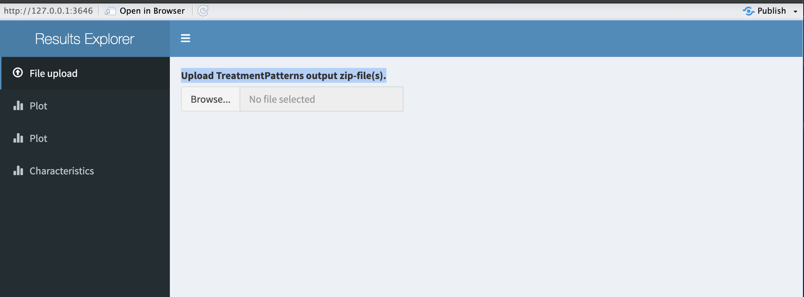

<!-- README.md is generated from README.Rmd. Please edit that file -->

# Epilepsy Treatment Pattern and Drug Utilization


-   Analytics use case(s): **Characterization**
-   Study type: **Clinical Application**
-   Tags: **Taiwan chapter, Australia chapter**
-   Study lead: **Phan Thanh Phuc, Nicole Pratt, Jason Hsu, Lan Kelly**
-   Study lead forums tag: **-**
-   Study start date: **June 2024**
-   Study end date: **-**
-   Protocol: **-**
-   Publications: **-**
-   Results explorer: **-**

### Introduction

In this study we will describe the utilization patterns of anti-epileptic medicines, identify sequential patterns of medicine use by tracking exposure episodes of patients over time as well as the length of time patients remain on a particular treatments or combinations of treatments. Identification of periods of exposure that are stable may may be reflective of treatment effectiveness.

## Installation

You can install the updated version of OHDSI packages like:

``` r
install.packages("remotes")
remotes::install_github("OHDSI/DatabaseConnector")
remotes::install_github("OHDSI/CohortGenerator")
remotes::install_github("OHDSI/ROhdsiWebApi")
remotes::install_github("darwin-eu-dev/‘TreatmentPatterns")
```

## Phenotype development

Run the script "/EpiDrug/inst/settings/CohortToCreate.R" to create the cohorts for the study

``` R
library(EpiDrug)
library(dplyr)

# Input connection setting
connectionDetails = DatabaseConnector::createConnectionDetails(dbms = "dbms", #input your database manager
                                                               server = "server", #input your server details
                                                               user = "user", #input your user name
                                                               password = "pwd",
                                                               pathToDriver = '~/driver') #input your password to acess your server
cdmDatabaseSchema = 'database schema'
cohortDatabaseSchema = 'cohortdatabaseschema'
databaseId <- "database ID"

# Get cohort definitions from Atlas
cohortIds <- c(483, #Overall epilepsy cohort
               614, #epilepsy cohort without diagnostic
               604, #Death
               539:558 #Drugs exposure
)
baseUrl = 'http://Atlas.link/WebAPI' #input your Atlas API link
cohortDefinitionSet <- ROhdsiWebApi::exportCohortDefinitionSet(
  baseUrl = baseUrl,
  cohortIds = cohortIds,
  generateStats = TRUE
)

# Insert cohort definitions from ATLAS into package -----------------------
packageRoot=getwd()
saveCohortDefinitionSet(cohortDefinitionSet,
  settingsFileName = file.path(
    packageRoot, "inst/settings/CohortsToCreate.csv"
  ),
  jsonFolder = file.path(packageRoot, "inst/cohorts"),
  sqlFolder = file.path(packageRoot, "inst/sql/sql_server")
)
```

## Execute Treatment Pattern

Run the script "/EpiDrug/extras/CohortToCreate.R" to excute the Treatment Pattern:

``` R
library(TreatmentPatterns)
library(CohortGenerator)
library(DatabaseConnector)
library(dplyr)

# Input temp folder & root folder
options(andromedaTempFolder = "~/andromedaTemp")
rootPackage=getwd()

# Input connection setting
connectionDetails = DatabaseConnector::createConnectionDetails(dbms = "dbms", #input your database manager
                                                               server = "server", #input your server details
                                                               user = "user", #input your user name
                                                               password = "pwd", #input your password to acess your server
                                                               pathToDriver = '~/driver')
cdmDatabaseSchema = 'database schema'
cohortDatabaseSchema = 'cohortdatabaseschema'
databaseId <- "database ID"

# Input cohort table
cohortTable <- 'Epilesy_drug'
cohortTableNames <- CohortGenerator::getCohortTableNames(cohortTable = cohortTable)
outputFolder=file.path(rootPackage,'ouput')

# Generate cohort on remote ----
cohortDefinitionSet <- getCohortDefinitionSet(
  settingsFileName = file.path(rootPackage,"inst/settings/CohortsToCreate.csv"),
  jsonFolder = file.path(rootPackage,"inst/cohorts"),
  sqlFolder = file.path(rootPackage,"inst/sql/sql_server")
)

CohortGenerator::createCohortTables(
  connectionDetails = connectionDetails,
  cohortDatabaseSchema = cohortDatabaseSchema,
  cohortTableNames = cohortTableNames,
  incremental = TRUE
)
cohortToCreate<-CohortGenerator::generateCohortSet(
  connectionDetails = connectionDetails,
  cdmDatabaseSchema = cdmDatabaseSchema,
  cohortTableNames = cohortTableNames,
  cohortDefinitionSet = cohortDefinitionSet,
  cohortDatabaseSchema = cohortDatabaseSchema,
  incremental = TRUE,
  incrementalFolder = file.path(outputFolder, "incremental")
)

# Set up cohorts for  TreatmentPatterns
num_rows <- cohortToCreate %>%
            slice(-2) %>% # change to (-1) if your Atlas have condition occurence
            nrow()
cohorts <- cohortToCreate %>%
  slice(-2) %>% # change to (-1) if your Atlas have condition occurence
  select("cohortId",'cohortName',) %>%
  mutate(type = c("target", "exit", rep("event", num_rows - 2)))

# Execute Treatment Patterns
executeTreatmentPatterns(
  cohorts = cohorts,
  cohortTableName = cohortTable,
  connectionDetails = connectionDetails,
  cdmSchema=cdmDatabaseSchema,
  resultSchema=cohortDatabaseSchema,
  outputPath = outputFolder,
  minEraDuration = 30,
  eraCollapseSize = 30,
  combinationWindow = 30,
  minCellCount = 5
)
```

## Explore the result

To explore the result, please run:

``` R
launchResultsExplorer()
```

The Shiny apps will appear as image below



Please upload the .zip file from the output folder to see the plots

### Reference

@TreatmentPatterns-3
